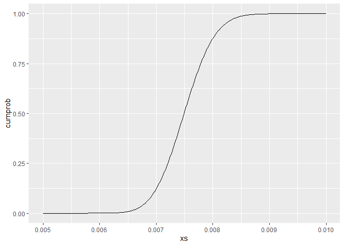
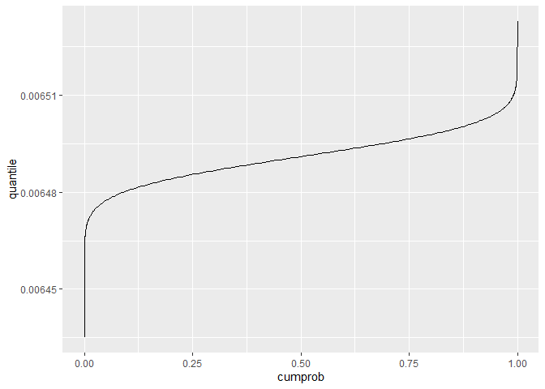
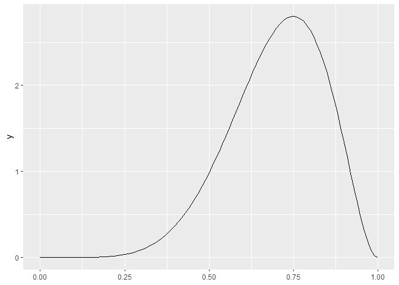
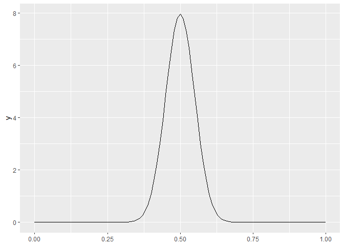
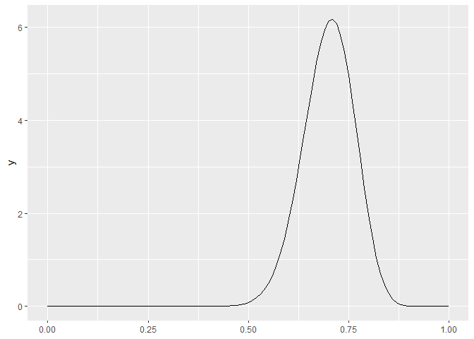

Chapter 2
=========

1.  What is the probability of rolling two six-sided dice and getting a
    value greater than 7?

<!-- -->

    # Find all possible combinations of die rolls and their sum
    dice <- expand.grid(roll_1 = c(1:6),
                        roll_2 = c(1:6)) %>%
      mutate(sum = roll_1 + roll_2)

    # Summing instances that meet criteria and finding proportions
    dice %>%
      mutate(criteria = ifelse(sum > 7, T, F)) %>%
      group_by(criteria) %>%
      summarize(total = n()) %>%
      mutate(proportion = total / sum(total))

    ## # A tibble: 2 x 3
    ##   criteria total proportion
    ##   <lgl>    <int>      <dbl>
    ## 1 FALSE       21      0.583
    ## 2 TRUE        15      0.417

1.  What is the probability of rolling three six-sided dice and getting
    a value greater than 7?

<!-- -->

    # Find all possible combinations of die rolls and their sum
    dice <- expand.grid(roll_1 = c(1:6),
                        roll_2 = c(1:6),
                        roll_3 = c(1:6)) %>%
      mutate(sum = roll_1 + roll_2 + roll_3)

    # Summing instances that meet criteria and finding proportions
    dice %>%
      mutate(criteria = ifelse(sum > 7, T, F)) %>%
      group_by(criteria) %>%
      summarize(total = n()) %>%
      mutate(proportion = total / sum(total))

    ## # A tibble: 2 x 3
    ##   criteria total proportion
    ##   <lgl>    <int>      <dbl>
    ## 1 FALSE       35      0.162
    ## 2 TRUE       181      0.838

1.  The Yankees are playing the Red Sox. You're a diehard Sox fan and
    bet your friend they'll win the game. You'll pay your friend $30 if
    the Sox lose and your friend will have to pay you only $5 if the Sox
    win. What is the probability you have intuitively assigned to the
    belief that the Red Sox will win?

<!-- -->

    # Calculating hypothesis ratio
    hyp_ratio <- 30 / 5
    hyp_ratio

    ## [1] 6

    # Calculating probability assigned to a Red Sox win
    hyp_ratio / (hyp_ratio + 1)

    ## [1] 0.8571429

Chapter 3
=========

1.  What is the probability of rolling a 20 three times in a row on a
    20-sided die?

<!-- -->

    # Finding combined probability
    (1/20) * (1/20) * (1/20)

    ## [1] 0.000125

1.  The weather report says there's a 10 percent chance of rain
    tomorrow, and you forget your umbrella half the time you go out.
    What is the probability that you'll be caught in the rain without an
    umbrella tomorrow?

<!-- -->

    # Probability of rain
    rain <- .1
    # Probability of you forgetting umbrella
    no_umbrella <- .5
    rain * no_umbrella

    ## [1] 0.05

1.  Raw eggs have a 1/20,000 probability of having salmonella. If you
    eat two raw eggs, what is the probability you ate a raw egg with
    salmonella?

<!-- -->

    # Want to find probability of egg 1 or egg 2 having salmonella
    # Events are not mutually exclusive
    ((1/20000) + (1/20000)) - ((1/20000) * (1/20000))

    ## [1] 9.99975e-05

1.  What is the probability of either flipping two heads in two coin
    tosses or rolling three 6s in three six-sided dice rolls?

<!-- -->

    # First finding probability of two heads in two chances
    coin <- .5 * .5
    # Finding prob of three 6s
    die <- (1/6) * (1/6) * (1/6)

    # Finding prob of either coin or die happening when they are mutually exclusive
    (coin + die) - (coin * die)

    ## [1] 0.2534722

Chapter 4
=========

1.  What are the parameters of the binomial distribution for the
    probability of rolling either a 1 or a 20 on a 20-sided die, if we
    roll the die 12 times?

<!-- -->

    # The number of outcomes we care about (successes)
    k <- 1

    # The number of trials
    n <- 12

    # The probability of the event happening
    p <- (1/20) + (1/20)

1.  There are four aces in a deck of 52 cards. If you pull a card,
    return the card, then reshuffle and pull a card again, how many ways
    can you pull just one ace in five pulls?

<!-- -->

    # Use the binomial coefficient
    choose(5, 1)

    ## [1] 5

1.  For the example in question 2, what is the probability of pulling
    five aces in 10 pulls (remember the card is shuffled back in the
    deck when it is pulled)?

<!-- -->

    # Calculating coefficient
    coefficient <- choose(10, 5)

    # Calculating probability of outcome
    probability <- (4/52)^5 * (1 - (4/52))^(10 - 5)

    coefficient * probability

    ## [1] 0.0004548553

1.  When you're searching for a new job, it's always helpful to have
    more than one offer on the table so you can use it in negotiations.
    If you have a 1/5 probability of receiving a job offer when you
    interview, and you interview with seven companies in a month, what
    is the probability you'll have at least two competing offers by the
    end of that month?

<!-- -->

    # Summing up probabilities of at least 2 job offers
    out_of_7 <- pbinom(q = 1, size = 7, prob = (1/5), lower.tail = F)

    out_of_7

    ## [1] 0.4232832

1.  You get a bunch of recruiter emails and find out you have 25
    interviews lined up in the next month. Unfortunately, you know this
    will leave you exhausted, and the probability of getting an offer
    will drop to 1/10 if you're tired. You really don't want to go on
    this many interviews unless you are at least twice as likely to get
    at least two competing offers. Are you more likely to get at least
    two offers if you go for 25 interviews, or stick to just 7?

<!-- -->

    # Summing up probabilities of at least 2 job offers
    out_of_25 <- pbinom(q = 1, size = 25, prob = (1/10), lower.tail = F)

    out_of_25

    ## [1] 0.7287941

    # The extra work isn't worth it
    out_of_25 / out_of_7

    ## [1] 1.721765

Chapter 5
=========

1.  You want to use the beta distribution to determine whether or not a
    coin you have is a fair coin-meaning that the coin gives you heads
    and tails equally. You flip the coin 10 times and get 4 heads and 6
    tails. Using the beta distribution, what is the probability that the
    coin will land on heads more than 60 percent of the time?

<!-- -->

    # Setting beta distribution parameters
    alpha <- 4
    beta <- 6

    # Finding sum of probabilities from .6 to 1
    # About 10% chance of landing on heads at least 60% of the time
    integrate(function(x) dbeta(x, alpha, beta), .6, 1)

    ## 0.09935258 with absolute error < 1.1e-15

1.  You flip the coin 10 more times and now have 9 heads and 11 tails
    total. What is the probability that the coin is fair, using our
    definition of fair, give or take 5 percent?

<!-- -->

    alpha <- 9
    beta <- 11

    # Integrating all possible probabilities between 45-55%
    # About 31% chance of coin being fair
    integrate(function(x) dbeta(x, alpha, beta), .45, .55)

    ## 0.30988 with absolute error < 3.4e-15

1.  Data is the best way to become more confident in your assertions.
    You flip the coin 200 more times and end up with 109 heads and 111
    tails. Now what is the probability that the coin is fair, give or
    take 5 percent?

<!-- -->

    alpha <- 109
    beta <- 111

    # About 86% chance of coin being fair
    integrate(function(x) dbeta(x, alpha, beta), .45, .55)

    ## 0.8589371 with absolute error < 9.5e-15

Chapter 6
=========

1.  What is the probability that a random person picked from the
    population is female and is not color blind?

<!-- -->

    # Product rule for dependent probabilities
    # P(Female) * P(Not Color Blind | Female)
    p_female <- .5
    p_ncb_female <- .995
    p_female * p_ncb_female

    ## [1] 0.4975

1.  What is the probability that a male who received the flu vaccine in
    2010 is either color blind or has GBS?

<!-- -->

    # Sum rule for independent probabilities
    # Events are not mutually exclusive
    p_cb_male <- .08
    p_gbs_vac <- (3 / 100000)
    (p_cb_male + p_gbs_vac) - (p_cb_male * p_gbs_vac)

    ## [1] 0.0800276

Chapter 7
=========

1.  Kansas City, despite its name, sits on the border of two US states:
    Missouri and Kansas. The Kansas City metropolitan area consists of
    15 counties, 9 in Missouri and 6 in Kansas. The entire state of
    Kansas has 105 counties and Missouri has 114. Use Bayes' theorem to
    calculate the probability that a relative who just moved to a county
    in the Kansas City metropolitan area also lives in a county in
    Kansas. Make sure to show P(Kansas) (assuming your relative either
    lives in Kansas or Missouri), P(Kansas City metropolitan area), and
    P(Kansas City metropolitan area | Kansas).

<!-- -->

    # P(Kansas | KC)
    # P(KC | Kansas) * P(Kansas) / P(KC)
    p_kansas <- 105 / (105 + 114)
    p_kc <- 15 / (105 + 114)
    p_kc_kansas <- 6 / 105

    (p_kc_kansas * p_kansas) / (p_kc)

    ## [1] 0.4

1.  A deck of cards has 52 cards with suits that are either red or
    black. There are four aces in a deck of cards: two red and two
    black. You remove a red ace from the deck and shuffle the cards.
    Your friend pulls a black card. What is the probability that it is
    an ace?

<!-- -->

    # P(Ace | Black)
    # P(Black | Ace) * P(Ace) / P(Black)
    p_ace <- 3 / 51
    p_black <- 26 / 51
    p_black_ace <- 2 / 3

    (p_black_ace * p_ace) / p_black

    ## [1] 0.07692308

Chapter 8
=========

1.  As mentioned, you might disagree with the original probability
    assigned to the likelihood:
    $P(broken window, open front door, missing laptop | robbed) = \\frac{3}{10}$

How much does this change our strength in believing H1 over H2?

    # Let's try making the likelihood 10x smaller
    likelihood <- 3 / 100
    prior <- 1 / 1000

    # Find ratio of updated hypothesis 1 to hypothesis 2
    # Our ratio has shrunk 10x in step with the likelihood
    (prior * likelihood) / (1 / 21900000)

    ## [1] 657

1.  How unlikely would you have to believe being robbed is-our prior for
    H1-in order for the ratio of H1 to H2 to be even?

<!-- -->

    # Have to multiply denominator of original prior by original ratio amount
    prior <- 1 / (1000 * 657)

    (prior * likelihood) / (1 / 21900000)

    ## [1] 1

Chapter 9
=========

1.  A friend finds a coin on the ground, flips it, and gets six heads in
    a row and then one tails. Give the beta distribution that describes
    this. Use integration to determine the probability that the true
    rate of flipping heads is between 0.4 and 0.6, reflecting that the
    coin is reasonably fair.

<!-- -->

    alpha <- 6
    beta <- 1

    integrate(function(x) dbeta(x, alpha, beta), .4, .6)

    ## 0.04256 with absolute error < 4.7e-16

1.  Come up with a prior probability that the coin is fair. Use a beta
    distribution such that there is at least a 95 percent chance that
    the true rate of flipping heads is between 0.4 and 0.6.

<!-- -->

    prior_alpha <- 55
    prior_beta <- 55

    integrate(function(x) dbeta(x, prior_alpha + 6, prior_beta + 1), .4, .6)

    ## 0.9527469 with absolute error < 1.5e-11

1.  Now see how many more heads (with no more tails) it would take to
    convince you that there is a reasonable chance that the coin is not
    fair. In this case, let's say that this means that our belief in the
    rate of the coin being between 0.4 and 0.6 drops below 0.5.

<!-- -->

    more_heads <- 23

    integrate(function(x) dbeta(x, prior_alpha + 6 + more_heads, prior_beta + 1), .4, .6)

    ## 0.4954059 with absolute error < 5.2e-11

Chapter 10
==========

1.  It's possible to get errors that don't quite cancel out the way we
    want. In the Fahrenheit temperature scale, 98.6 degrees is the
    normal body temperature and 100.4 degrees is the typical threshold
    for a fever. Say you are taking care of a child that feels warm and
    seems sick, but you take repeated readings from the thermometer and
    they all read between 99.5 and 100.0 degrees: warm, but not quite a
    fever. You try the thermometer yourself and get several readings
    between 97.5 and 98. What could be wrong with the thermometer?

**The thermometer could be under-reading temperatures.**

1.  Given that you feel healthy and have traditionally had a very
    consistently normal temperature, how could you alter the
    measurements 100, 99.5, 99.6, and 100.2 to estimate if the child has
    a fever?

**Add on somewhere between .5 and 1 degree to all measurements.**

Chapter 11
==========

1.  One of the benefits of variance is that squaring the differences
    makes the penalties exponential. Give some examples of when this
    would be a useful property.

**Provides more of a penalty for really spread out data.**

1.  Calculate the mean, variance, and standard deviation for the
    following values: 1, 2, 3, 4, 5, 6, 7, 8, 9, 10.

<!-- -->

    example_vector <- c(1, 2, 3, 4, 5, 6, 7, 8, 9, 10)

    # Mean
    mean(example_vector)

    ## [1] 5.5

    # Variance
    var(example_vector)

    ## [1] 9.166667

    # Standard Deviation
    sd(example_vector)

    ## [1] 3.02765

Chapter 12
==========

1.  What is the probability of observing a value five sigma greater than
    the mean or more?

<!-- -->

    # Integrate from 5 to a reasonably large number
    integrate(function(x) dnorm(x, 0, 1), 5, 100)

    ## 2.88167e-07 with absolute error < 5.6e-07

1.  A fever is any temperature greater than 100.4 degrees Fahrenheit.
    Given the following measurements, what is the probability that the
    patient has a fever? 100.0, 99.8, 101.0, 100.5, 99.7

<!-- -->

    temp_vector <- c(100, 99.8, 101, 100.5, 99.7)

    integrate(function(x) dnorm(x, mean = mean(temp_vector),
                                sd = sd(temp_vector)),
              100.4, 200)

    ## 0.3563509 with absolute error < 1.1e-08

1.  Suppose in Chapter 11 we tried to measure the depth of a well by
    timing coin drops and got the following values: 2.5, 3, 3.5, 4, 2
    The distance an object falls can be calculated (in meters) with the
    following formula: distance = 1/2 x G x time2 where G is 9.8 m/s/s.
    What is the probability that the well is over 500 meters deep?

<!-- -->

    well_vector <- c(2.5, 3, 3.5, 4, 2)

    time <- sqrt((500 * 2) / 9.8)

    integrate(function(x) dnorm(x, mean = mean(well_vector),
                                sd = sd(well_vector)),
              time, 200)

    ## 7.825278e-20 with absolute error < 1.6e-19

1.  What is the probability there is no well (i.e., the well is really 0
    meters deep)? You'll notice that probability is higher than you
    might expect, given your observation that there is a well. There are
    two good explanations for this probability being higher than it
    should. The first is that the normal distribution is a poor model
    for our measurements; the second is that, when making up numbers for
    an example, I chose values that you likely wouldn't see in real
    life. Which is more likely to you?

<!-- -->

    dnorm(0, mean = mean(well_vector), sd = sd(well_vector))

    ## [1] 0.000376747

Chapter 13
==========

1.  Using the code example for plotting the PDF on page 127, plot the
    CDF and quantile functions.

<!-- -->

    example <- tibble(xs = seq(0.005, 0.01, by = 0.00001)) %>%
      mutate(cumprob = pbeta(xs, 300, 40000 - 300),
             quantile = qbeta(xs, 300, 40000 - 300))

    # CDF Plot
    example %>%
      ggplot(aes(x = xs, y = cumprob)) +
      geom_line()

    # Quantile Plot
    example %>%
      ggplot(aes(x = cumprob, y = quantile)) +
      geom_line()

1.  Returning to the task of measuring snowfall from Chapter 10, say you
    have the following measurements (in inches) of snowfall: 7.8, 9.4,
    10.0, 7.9, 9.4, 7.0, 7.0, 7.1, 8.9, 7.4 What is your 99.9 percent
    confidence interval for the true value of snowfall?

<!-- -->

    snow_vector <- c(7.8, 9.4, 10.0, 7.9, 9.4, 7.0, 7.0, 7.1, 8.9, 7.4)

    # Lower bound
    qnorm(.025, mean = mean(snow_vector),
          sd = sd(snow_vector))

    ## [1] 5.965923

    # Upper bound
    qnorm(.975, mean = mean(snow_vector),
          sd = sd(snow_vector))

    ## [1] 10.41408

1.  A child is going door to door selling candy bars. So far she has
    visited 30 houses and sold 10 candy bars. She will visit 40 more
    houses today. What is the 95 percent confidence interval for how
    many candy bars she will sell the rest of the day?

<!-- -->

    # Lower bound
    lb <- qbeta(.025, shape1 = 10, shape2 = 20)
    # Upper bound
    ub <- qbeta(.975, shape1 = 10, shape2 = 20)

    # Putting bounds on scale of houses left
    lb * 40

    ## [1] 7.175346

    ub * 40

    ## [1] 20.33293

Chapter 14
==========

1.  Suppose you're playing air hockey with some friends and flip a coin
    to see who starts with the puck. After playing 12 times, you realize
    that the friend who brings the coin almost always seems to go first:
    9 out of 12 times. Some of your other friends start to get
    suspicious. Define prior probability distributions for the following
    beliefs: One person who weakly believes that the friend is cheating
    and the true rate of coming up heads is closer to 70 percent. One
    person who very strongly trusts that the coin is fair and provided a
    50 percent chance of coming up heads. One person who strongly
    believes the coin is biased to come up heads 70 percent of the time.

<!-- -->

    # Creating some fake priors and plotting them
    priors <- list(weak_bias = c(7, 3),
                   very_strong_fair = c(50, 50),
                   strong_bias = c(35, 15))

    map(priors,
        ~ ggplot() +
          stat_function(fun = function(x) dbeta(x, .x[1], .x[2])))

    ## $weak_bias

    ## 
    ## $very_strong_fair

    ## 
    ## $strong_bias

1.  To test the coin, you flip it 20 more times and get 9 heads and 11
    tails. Using the priors you calculated in the previous question,
    what are the updated posterior beliefs in the true rate of flipping
    a heads in terms of the 95 percent confidence interval?

<!-- -->

    # Updating initial flips
    heads <- 9 + 9
    tails <- 3 + 11

    # Updating prior beliefs
    updated_beliefs <- map(priors, ~ c(.x[1] + heads, .x[2] + tails))

    map(updated_beliefs, ~ c(qbeta(.025, .x[1], .x[2]),
                             qbeta(.975, .x[1], .x[2])))

    ## $weak_bias
    ## [1] 0.4450478 0.7368320
    ## 
    ## $very_strong_fair
    ## [1] 0.4301357 0.5997323
    ## 
    ## $strong_bias
    ## [1] 0.5404147 0.7455052

Chapter 15
==========

1.  Suppose a director of marketing with many years of experience tells
    you he believes very strongly that the variant without images (B)
    won't perform any differently than the original variant. How could
    you account for this in our model? Implement this change and see how
    your final conclusions change as well.

<!-- -->

    # Prior is already the same for A and B, but is weak
    # We could create a stronger prior for both A and B
    prior_clicks <- 30
    prior_no_clicks <- 70

    set.seed(1234)
    a <- rbeta(100000, prior_clicks + 36, prior_no_clicks + 114)
    b <- rbeta(100000, prior_clicks + 50, prior_no_clicks + 100)

    # B is still heavily favored to be clicked, but has decreased
    sum(b > a) / 100000

    ## [1] 0.91619

1.  The lead designer sees your results and insists that there's no way
    that variant B should perform better with no images. She feels that
    you should assume the conversion rate for variant B is closer to 20
    percent than 30 percent. Implement a solution for this and again
    review the results of our analysis.

<!-- -->

    updated_prior_clicks <- 20
    updated_prior_no_clicks <- 80

    set.seed(1234)
    b <- rbeta(100000, updated_prior_clicks + 50, updated_prior_no_clicks + 100)

    # Proportion of B has decreased, but is still more than A
    sum(b > a) / 100000

    ## [1] 0.66602

Chapter 16
==========

1.  Returning to the dice problem, assume that your friend made a
    mistake and suddenly realized that there were, in fact, two loaded
    dice and only one fair die. How does this change the prior, and
    therefore the posterior odds, for our problem? Are you more willing
    to believe that the die being rolled is the loaded die?

<!-- -->

    p_d_h1 <- (.5^4) * (.5^6)
    p_d_h2 <- ((1 / 6)^4) * ((5 / 6)^6)

    p_h1 <- 2 / 3
    p_h2 <- 1 / 3

    # Posterior odds have increased substantially
    (p_d_h1 * p_h1) / (p_d_h2 * p_h2)

    ## [1] 7.558272

1.  Returning to the rare diseases example, suppose you go to the
    doctor, and after having your ears cleaned you notice that your
    symptoms persist. Even worse, you have a new symptom: vertigo. The
    doctor proposes another possible explanation, labyrinthitis, which
    is a viral infection of the inner ear in which 98 percent of cases
    involve vertigo. However, hearing loss and tinnitus are less common
    in this disease; hearing loss occurs only 30 percent of the time,
    and tinnitus occurs only 28 percent of the time. Vertigo is also a
    possible symptom of vestibular schwannoma, but occurs in only 49
    percent of cases. In the general population, 35 people per million
    contract labyrinthitis annually. What is the posterior odds when you
    compare the hypothesis that you have labyrinthitis against the
    hypothesis that you have vestibular schwannoma?

<!-- -->

    p_d_new_disease <- .98 * .3 * .28
    p_d_old_disease <- .49 * .94 * .83

    p_new_disease <- 35 / 1000000
    p_old_disease <- 11 / 1000000

    # About 30% more likely to have vestibular schannoma
    (p_d_new_disease * p_new_disease) / (p_d_old_disease * p_old_disease)

    ## [1] 0.685139

Chapter 17
==========

1.  Every time you and your friend get together to watch movies, you
    flip a coin to determine who gets to choose the movie. Your friend
    always picks heads, and every Friday for 10 weeks, the coin lands on
    heads. You develop a hypothesis that the coin has two heads sides,
    rather than both a heads side and a tails side. Set up a Bayes
    factor for the hypothesis that the coin is a trick coin over the
    hypothesis that the coin is fair. What does this ratio alone suggest
    about whether or not your friend is cheating you?

<!-- -->

    p_d_h1 <- 1
    p_d_h2 <- .5^10
    # Probability that it's a trick coin is 1024x more likely
    p_d_h1 / p_d_h2

    ## [1] 1024

1.  Now imagine three cases: that your friend is a bit of a prankster,
    that your friend is honest most of the time but can occasionally be
    sneaky, and that your friend is very trustworthy. In each case,
    estimate some prior odds ratios for your hypothesis and compute the
    posterior odds.

<!-- -->

    p_sneaky <- 1
    p_mostly_honest <- 1 / 5
    p_trustworthy <- 1 / 10000

    p_sneaky * (p_d_h1 / p_d_h2)

    ## [1] 1024

    p_mostly_honest * (p_d_h1 / p_d_h2)

    ## [1] 204.8

    p_trustworthy * (p_d_h1 / p_d_h2)

    ## [1] 0.1024

1.  Suppose you trust this friend deeply. Make the prior odds of them
    cheating 1/10,000. How many times would the coin have to land on
    heads before you feel unsure about their innocence-say, a posterior
    odds of 1?

<!-- -->

    p_trustworthy * (p_d_h1 / (.5^14))

    ## [1] 1.6384

1.  Another friend of yours also hangs out with this same friend and,
    after only four weeks of the coin landing on heads, feels certain
    you're both being cheated. This confidence implies a posterior odds
    of about 100. What value would you assign to this other friend's
    prior belief that the first friend is a cheater?

<!-- -->

    100 / (p_d_h1 / (.5^4))

    ## [1] 6.25
